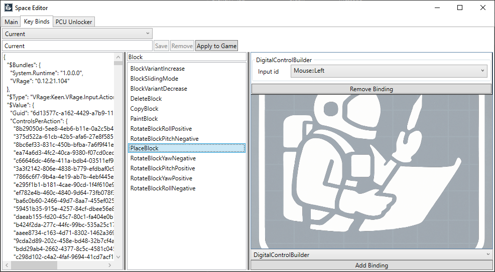

# Space Editor

*When you need to mess with SE2 files in style*

Space Editor is a standalone tool for tinkering with Space Engineers 2  ([SpaceEngineersGame.com](https://2.spaceengineersgame.com/)). 

 
 

## Features
Space Editor can currently edit Key bindings on SE2 game.

## Installation
1) Navigate to [Releases](https://github.com/InflexCZE/SpaceEditor/releases) and download latest Space Editor archive.
2) Extract Space Editor archive anywhere on your disk.
3) Locate the `SpaceEditor.exe` to start the editor.
4) Make desired changes to the game and restart the game to observe the changes.

## How to undo all modifications
Steam can automatically detect and revert any changes done to games.  
You can use this feature to undo any modifications: https://help.steampowered.com/en/faqs/view/0C48-FCBD-DA71-93EB  
Your game is now Vanilla again, should run normally.

> Note that Steam may override your changes during game updates. In such case, just apply your changes again.

## Contribution Welcomed
If you feel like there is something missing in the Space Editor, find bugs or room for improvements, feel free to open an issue or commit pull request directly.
Space Editor is community-made project, by community for community.
If you land a hand everyone benefits.

## Disclamer
Space Editor can make the game unstable and/or crash.
Under no circumstances shall the author(s) be held responsible or liable in any way for any claims, damages, losses, expenses, costs, liabilities or lost space ships whatsoever caused directly or indirectly by Space Editor or derived software.
